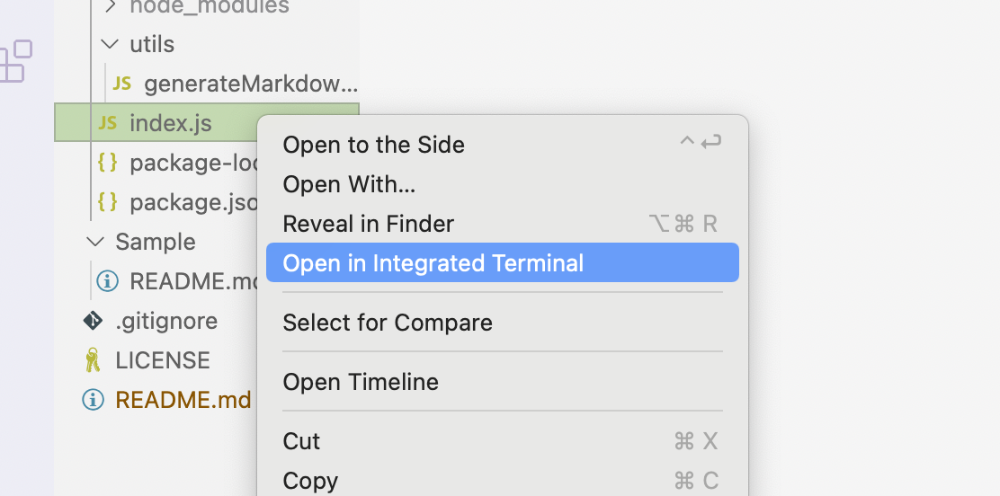
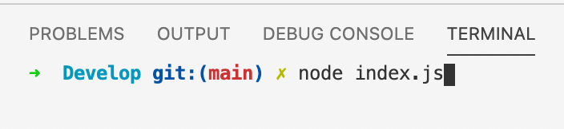
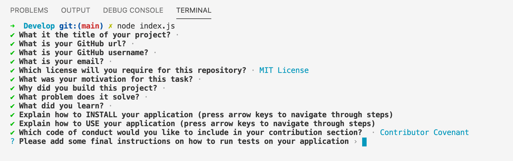
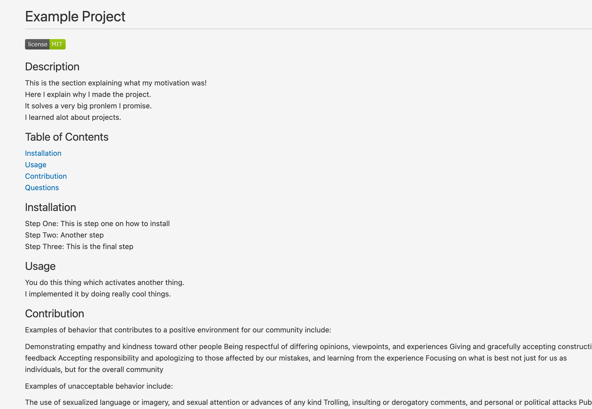

# Read Me Generator

## Deployment

In order to deploy the application you will have to execute it in node (see running the application section).  
Link to demonstration video: [Demo Video](https://drive.google.com/file/d/1ldJNjRdSL0iphe_XdqDEloTAJFAN2FU9/view?usp=sharing)

## Why make this?
Programmers and web developers often waste time creating good quality read-me files instead of focusing on the task ahead. This application automatically generates one for you in minutes!

## My goal
The goal was to simplify the creation process of read-me files by using npm packages and node intergartion. 

## Running the application

Here you will need to run the index.js file in the intergrated terminal on mac.  

## Filling out the prompts

Here the computer will ask for information that will apply to the read me file.  

## Created ReadMe

This is an example of a generated file in preview mode.

## End note
I hope you enjoyed going through my application and hopefully you will be able to create superb read me files :)
